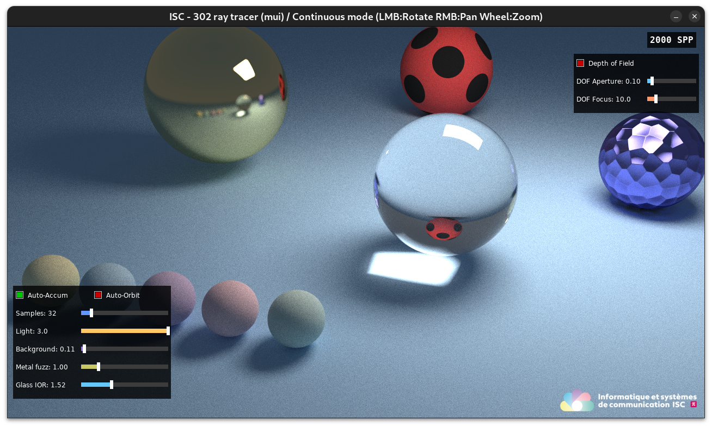
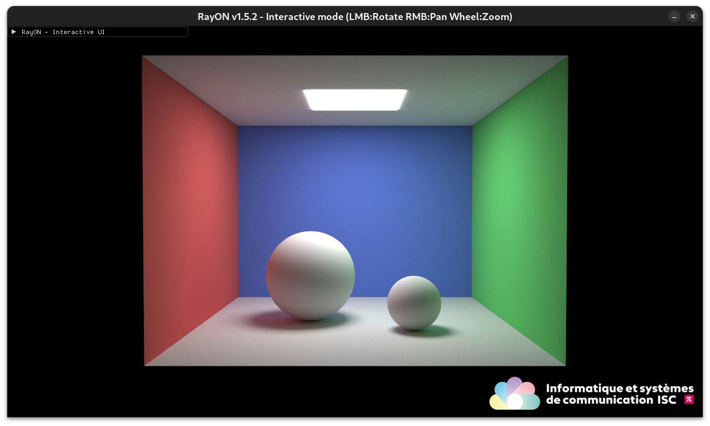
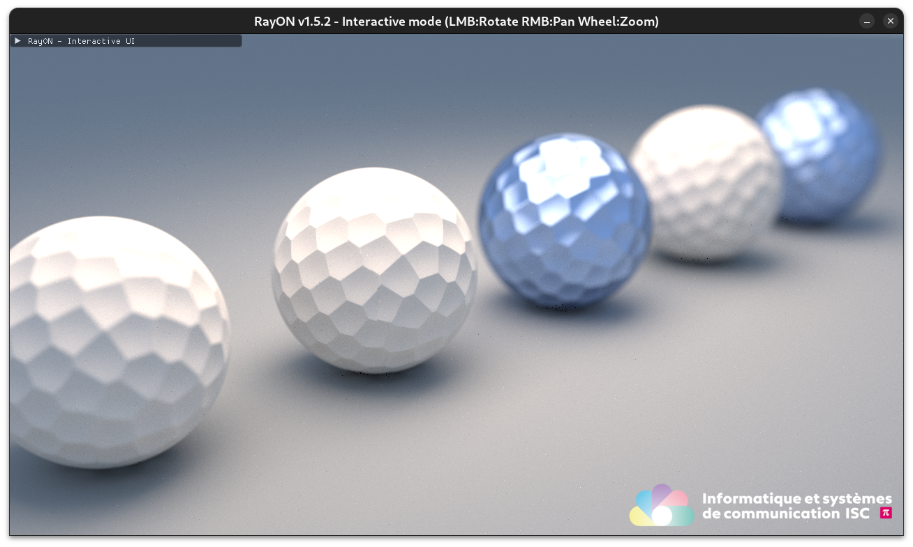
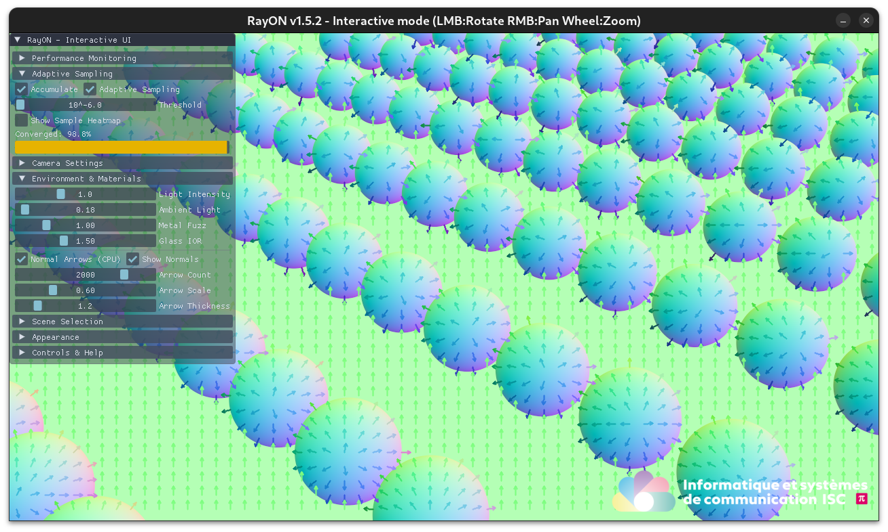

[](https://www.gnu.org/licenses/agpl-3.0) 

# _RayON_ - An interactive ray-tracer

---
Dr Pierre-André Mudry, 2025-2026.

<p align="center">
    
</p>

<p align="center">
    <a href="#sample-gallery">Open the sample gallery</a>
</p>

Based on the [Ray-tracing In One Weekend](https://github.com/RayTracing/raytracing.github.io/tree/release/src/InOneWeekend) series, an amazing resource for discovering ray-tracing magic! 

This project started as a hand-made reimplementation of the `InOneWeekend` ray tracer to better understand how it works. It evolved into an interactive, real-time path tracer with progressive sample accumulation. As a result, there are multiple renderers available:

1. CPU single-threaded (useless)
1. CPU multi-threaded
1. GPU CUDA accelerated
1. GPU CUDA real-time raytracing with accumulative sampling

## Quick start

```bash
mkdir -p build
cd build
cmake .. --fresh
make -j
./rayon --help
```

## Interactive performance

In interactive mode, the renderer is real-time on the development machine (DGX Spark) with a 100 Hz monitor. Frame rate varies with scene complexity and sample settings, while progressive accumulation keeps the display responsive as samples converge.

It uses `stb` [single-file public domain (or MIT licensed) libraries for C/C++](https://github.com/nothings/stb/tree/master) for opening and saving images as well as immediate-mode GUI controls using [Dear ImGui](https://github.com/ocornut/imgui).

# Sample gallery

Representative renders from different scenes and material setups.

<details open>
<summary>Rendered samples from <code>images/samples</code></summary>

<p align="center">
    
    
</p>

<p align="center">
    
    
</p>

<p align="center">
    
    
</p>

<p align="center">
    
    
</p>

</details>

You can load additional examples from `resources/scenes/`.

# Build and environment setup in VS Code

## Using `cmake` to generate compilation files and build using `make`

Create manually via

```bash
mkdir build
cd build
cmake .. --fresh
make -j
```

This will generate the appropriate `compile_commands.json` for `clangd` so that you get syntax highlighting, code completion etc. in VS Code. Additionally, CMake automatically updates the `.clangd` file with include paths for all subdirectories under `src/`, ensuring clangd has the correct `-I` flags without manual maintenance. You can then run from the `build directory`

```bash
./rayon --help
```

Or all at once:

## Running
```bash
make -j && ./rayon -m 2
```

Rendered frames are written to `rendered_images/` with timestamped filenames such as `output_2025-11-15_14-22-09.png`. Each run produces a new PNG (timestamp uses local time, second precision), so you can sort files chronologically without overwriting previous renders.

## Within VSCode

Install extension `clangd` from `LLVM`. To make `clangd` work, ensure `compile_commands.json` is present (generated automatically from `CMakeLists.txt` during the `cmake` phase above). This project uses `.hpp` for C++ headers as a convention; keeping that convention helps tooling and includes stay consistent.

The project also integrates `clang-tidy` for static analysis. If `clang-tidy` is installed, CMake will enable it automatically during builds to check for code issues, style violations, and potential bugs. A `.clang-tidy` configuration file is provided to customize the checks.

This is all you need. There are *tasks* created in the `.vscode` folder that can be launched with `CTRL+Shift+P` -> Tasks and then you can build, and run. You can even setup key bindings for that.

## Build documentation

If required, the documentation can be built with `doxygen`, which should be run in the main directory. The results are not saved in the git repository to save space.

# Contributing
PRs are welcome, please feel free to contribute.

# Known issues

- Compilation has been tested on `DGX Spark`, other platforms are untested yet.
- The code depends on a proper installation of [`libsdl`](https://www.libsdl.org/) for creating the real-time rendering context. It might work without it in non-interactive mode, but this has not been tested. Use at your own risk (or create a PR).