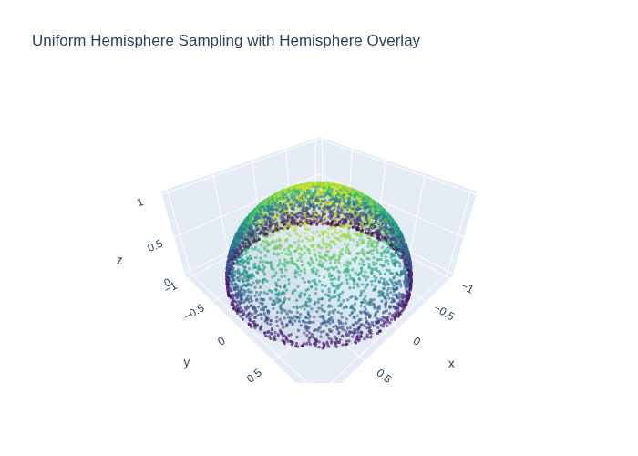
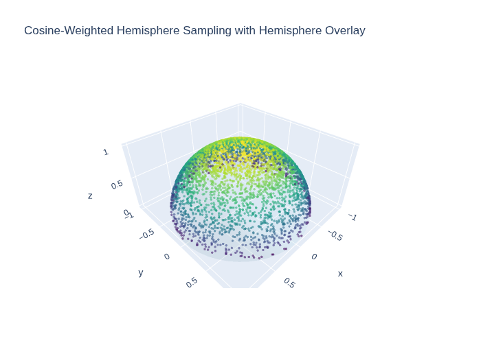
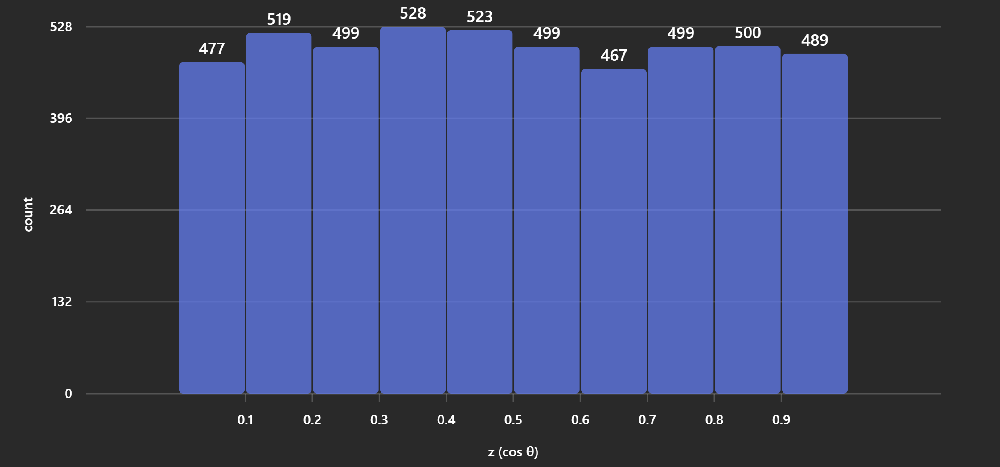
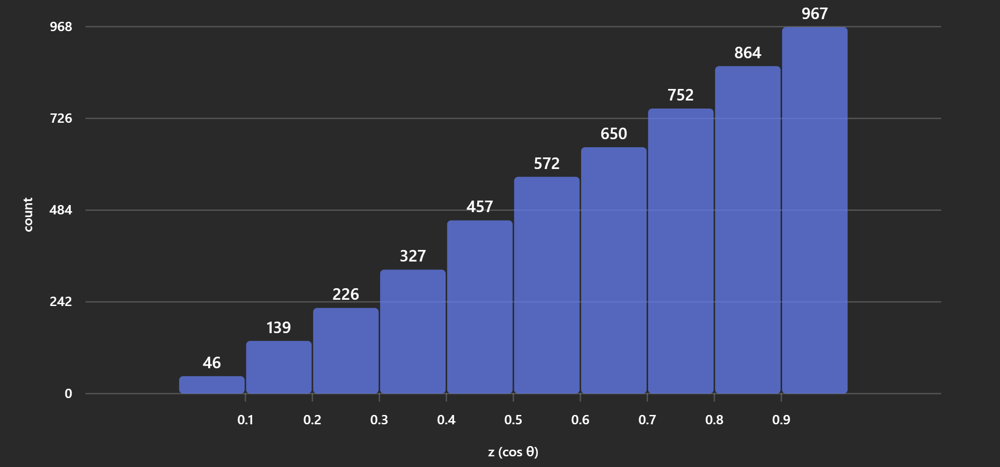

# Lambertian Sampling Methods in CUDA

## 1. Uniform Hemisphere Sampling

- **How it works**: Pick a random point inside a unit sphere, normalize, and flip if dot`(normal, dir) < 0`.

- **Distribution**: Every direction in the hemisphere is equally likely.

- **Impact** : Does not match Lambert’s cosine law (which favors directions near the normal). Higher variance in Monte Carlo integration → more noise for the same number of samples.

- Pros:
    - Simple to implement.
    - Works for any BRDF if combined with importance sampling later.

- Cons:

    - Inefficient for diffuse surfaces because most samples contribute little (grazing angles).

### CUDA Code
```cpp
__device__ float3 random_in_unit_sphere(curandState* rng) {
    float3 p;
    do {
        p = make_float3(curand_uniform(rng)*2.0f - 1.0f,
                        curand_uniform(rng)*2.0f - 1.0f,
                        curand_uniform(rng)*2.0f - 1.0f);
    } while (dot(p, p) >= 1.0f);
    return p;
}

__device__ float3 uniform_hemisphere_sample(curandState* rng, const float3& normal) {
    float3 dir = normalize(random_in_unit_sphere(rng));
    if (dot(dir, normal) < 0.0f) dir = -dir;
    return dir;
}
```

---

## 2. Cosine-Weighted Hemisphere Sampling

**How it works**: Probability ∝ cos(θ), where θ is the angle from the normal.
Distribution: More samples near the normal, fewer near the horizon.

- Impact:
    - Matches Lambertian BRDF exactly → lower variance.
    - Faster convergence in path tracing.

- Pros:
    - Physically correct for diffuse reflection.
    - Reduces noise significantly.

- Cons:

    - Slightly more math (orthonormal basis + polar coords).
    - Still needs random number generation per sample.

### CUDA Code
```cpp
__device__ void build_orthonormal_basis(const float3& n, float3& tangent, float3& bitangent) {
    float3 up = fabs(n.x) > 0.9f ? make_float3(0, 1, 0) : make_float3(1, 0, 0);
    tangent = normalize(cross(up, n));
    bitangent = cross(n, tangent);
}

__device__ float3 sample_cosine_weighted_hemisphere(curandState* rng, const float3& normal) {
    float u1 = curand_uniform(rng);
    float u2 = curand_uniform(rng);

    float r = sqrtf(u1);
    float theta = 2.0f * CUDART_PI_F * u2;

    float x = r * cosf(theta);
    float y = r * sinf(theta);
    float z = sqrtf(1.0f - u1);

    float3 tangent, bitangent;
    build_orthonormal_basis(normal, tangent, bitangent);

    return normalize(x * tangent + y * bitangent + z * normal);
}
```

##  Performance Comparison

- Variance: Cosine-weighted sampling typically reduces variance by 2× or more for diffuse surfaces.
- Render speed: Same number of rays, but fewer samples wasted → cleaner image for same compute budget.
- Implementation complexity: Uniform sphere = ~5 lines; cosine-weighted = ~15 lines (basis + math).

## Visual Difference

- Uniform sampling → noisy shadows, slow convergence.
- Cosine-weighted → smoother diffuse shading with fewer samples.

---

## Visual Comparisons

### Sampling with Hemisphere Overlay




### Histograms of z-values (cos θ)





---

## Key Takeaways
- Use **cosine-weighted sampling** for diffuse shading: physically correct and reduces noise.
- Uniform sampling is simpler but less efficient for Lambertian surfaces.
