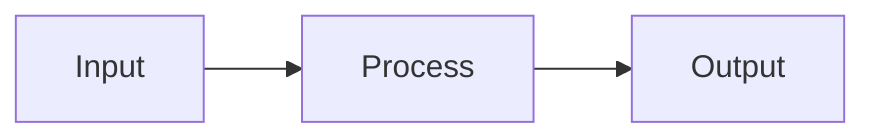

# Documentation website

The project documentation is a [MkDocs Material](https://squidfunk.github.io/mkdocs-material/)
site whose source lives in `docs/` on the `main` branch.
GitHub Actions builds it automatically and pushes the result to the `gh-pages` branch,
which GitHub Pages serves as https://pmudry.github.io/RayON.

---

## Prerequisites (one-time install)

This project uses [uv](https://docs.astral.sh/uv/) for reproducible dependency management.

```bash
# Install uv (if not already present)
curl -LsSf https://astral.sh/uv/install.sh | sh

# Install all docs dependencies into an isolated venv
uv sync --group docs
```

---

## Preview locally

```bash
# From the repo root
uv run mkdocs serve
```

Open http://localhost:8000.

**Live reload** is enabled — save any `.md` file under `docs/` and the browser refreshes
automatically. Images are copied from `images/`, `explanations/lambert sampling/`, and
`material_gallery/thumbnails/` at startup by the `hooks.py` build hook.

---

## Build the static site locally

```bash
uv run mkdocs build
# Output is written to site/ (git-ignored)
```

Use this to check for broken links or build errors before pushing:

```bash
uv run mkdocs build --strict   # treats warnings as errors
```

---

## Deploy to GitHub Pages

### Automatic (recommended)

Push any change to `docs/**`, `mkdocs.yml`, or `hooks.py` on `main`.
The workflow at `.github/workflows/deploy-docs.yml` runs automatically and publishes the site.

### Manual trigger

Go to **Actions → Deploy Documentation → Run workflow** on GitHub.

### First-time setup (do this once)

1. Push the `main` branch with the files in this repo.
2. Go to **Settings → Pages** in the GitHub repository.
3. Under *Source*, select **Deploy from a branch**.
4. Set branch to `gh-pages`, directory `/` (root).
5. Save. The site will be live at `https://pmudry.github.io/RayON` after the first workflow run.

---

## File layout

```
mkdocs.yml              ← MkDocs configuration (theme, nav, extensions)
hooks.py                ← Build hook: copies images into docs/assets/images/ at build time
docs/
├── index.md            ← Home page
├── getting-started.md
├── gallery.md
├── performance.md
├── how-it-works/
│   ├── index.md
│   ├── ray-tracing.md
│   ├── materials.md
│   ├── bvh.md
│   └── sampling.md
├── architecture/
│   ├── index.md
│   ├── scene-system.md
│   ├── cuda-renderer.md
│   └── progressive-rendering.md
├── features/
│   ├── index.md
│   ├── interactive.md
│   ├── scenes.md
│   ├── sdf-shapes.md
│   └── obj-loading.md
├── assets/
│   ├── extra.css       ← Custom CSS
│   ├── mathjax.js      ← MathJax configuration
│   └── images/         ← GENERATED — do not commit; populated by hooks.py at build time
└── overrides/
    └── main.html       ← MkDocs theme override (minimal)
```

> **Note:** `docs/assets/images/` is git-ignored because it is populated automatically from the
> source image directories (`images/`, `explanations/lambert sampling/`, `material_gallery/thumbnails/`).
> Never commit files into `docs/assets/images/` manually.

---

## Adding or editing a page

1. Edit the relevant `.md` file under `docs/`.
2. Run `mkdocs serve` to preview.
3. Add the page to the `nav:` section of `mkdocs.yml` if it is a new file.
4. Push to `main` — the site redeploys automatically.

---

## Adding new render images

1. Run the raytracer and produce a PNG:
   ```bash
   cd build
   ./rayon --scene ../resources/scenes/05_material_laboratory.yaml -s 512 -r 1080
   # choose renderer 2 (CUDA GPU)
   cp rendered_images/latest.png ../docs/assets/images/renders/my_render.png
   ```
2. Reference it in Markdown:
   ```markdown
   
   ```
3. Commit the PNG. Unlike the automatically-copied images, files placed directly in
   `docs/assets/images/renders/` are tracked by git and served as-is.

---

## Math equations

Inline math uses `\(...\)`, display math uses `\[...\]`:

```markdown
Inline: \(\mathbf{r}(t) = \mathbf{o} + t\,\mathbf{d}\)

Display:
\[
L_o = L_e + \int_\Omega f_r L_i \cos\theta \, d\omega_i
\]
```

These are rendered by MathJax 3 via the CDN configured in `mkdocs.yml`.

---

## Diagrams

Use fenced Mermaid blocks:

````markdown

````

Mermaid is bundled with MkDocs Material — no extra dependencies needed.
