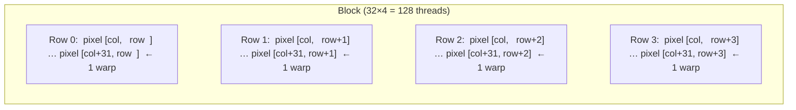

# CUDA Renderer

The CUDA renderer is the primary high-performance back-end. This page explains how a single
CUDA kernel maps to image pixels, how memory is managed, and the design choices that make it fast.

---

## Kernel launch configuration

### Thread block shape: 32 × 4

RayON uses a rectangular 2D thread block of **32 columns × 4 rows = 128 threads**:

```cpp
dim3 block_size(32, 4);   // 128 threads per block
dim3 grid_size(
    (image_width  + block_size.x - 1) / block_size.x,
    (image_height + block_size.y - 1) / block_size.y
);
renderPixelsKernel<<<grid_size, block_size>>>(...);
```

Why 32 × 4 instead of, say, 16 × 8?

- **32 threads per row** aligns with one CUDA warp (32 threads that execute in lock-step).
  Adjacent pixels in the same row touch adjacent memory addresses — the memory access is
  **coalesced** and served in one transaction rather than 32 separate ones.
- **4 rows** keeps the block at 128 threads, a reasonable occupancy multiplier, without
  wasting shared memory or occupancy.



### Thread → pixel mapping

Each thread computes its pixel coordinates from its block and thread indices:

```cpp
__global__ void renderPixelsKernel(uint8_t* output, int width, int height, ...) {
    int col = blockIdx.x * blockDim.x + threadIdx.x;
    int row = blockIdx.y * blockDim.y + threadIdx.y;

    if (col >= width || row >= height) return; // guard for non-multiple resolutions

    int pixel_index = row * width + col;
    // ... trace ray for (col, row)
}
```

---

## Random number generation

Every pixel needs independent random numbers. RayON uses NVIDIA's **curand** library with
per-thread persistent state:

```cpp
// Initialisation — called once per pixel on first launch
curand_init(
    (unsigned long long)(row * width + col),  // unique seed per pixel
    0,                                          // sequence offset
    0,                                          // subsequence
    &rng_states[pixel_index]
);
```

The `rng_state` array lives in device memory and is **reused across accumulative frames** —
re-initialising it every frame would reset the random sequence and cause visible patterns.
For the one-shot renderer, states are allocated, used, then freed.

---

## Accumulation buffer

For progressive (multi-sample) rendering, simply averaging uint8 RGB values loses precision.
RayON keeps a **float accumulation buffer** on the GPU:

```cpp
// Device memory — 3 floats per pixel (per channel running sum)
float* d_accumulation_buffer; // RGB, float per channel
cudaMalloc(&d_accumulation_buffer, width * height * 3 * sizeof(float));
```

After each kernel pass, the float sums are normalised and gamma-corrected **on the GPU**:

```cpp
__global__ void gammaCorrectKernel(const float* accum, uint8_t* display, int num_pixels, int spp) {
    int idx = blockIdx.x * blockDim.x + threadIdx.x;
    if (idx >= num_pixels) return;

    float r = sqrtf(accum[idx*3 + 0] / spp); // sqrt = gamma 2.0 correction
    float g = sqrtf(accum[idx*3 + 1] / spp);
    float b = sqrtf(accum[idx*3 + 2] / spp);

    display[idx*3 + 0] = (uint8_t)(clamp(r, 0.f, 1.f) * 255.f);
    display[idx*3 + 1] = (uint8_t)(clamp(g, 0.f, 1.f) * 255.f);
    display[idx*3 + 2] = (uint8_t)(clamp(b, 0.f, 1.f) * 255.f);
}
```

Only the compact **uint8 display buffer** (3 bytes/pixel) is copied device → host.
The accumulation buffer stays on the GPU until the session ends.

This eliminates the round-trip that previously transferred the full float buffer each frame —
a 4× reduction in D2H bandwidth.

---

## Error handling

Every CUDA API call is wrapped with `CUDA_CHECK()`:

```cpp
// From cuda_utils.cuh
#define CUDA_CHECK(call)                                                   \
    do {                                                                   \
        cudaError_t err = (call);                                          \
        if (err != cudaSuccess) {                                          \
            fprintf(stderr, "CUDA error %s:%d — %s\n",                   \
                    __FILE__, __LINE__, cudaGetErrorString(err));          \
            exit(EXIT_FAILURE);                                            \
        }                                                                  \
    } while (0)

// Usage
CUDA_CHECK(cudaMalloc(&d_scene, sizeof(CudaScene::Scene)));
CUDA_CHECK(cudaMemcpy(d_scene, &h_scene, sizeof(CudaScene::Scene), cudaMemcpyHostToDevice));
```

For kernel launches, the error check happens after synchronisation:

```cpp
myKernel<<<grid, block>>>(...);
CUDA_CHECK(cudaGetLastError());      // catches launch errors
CUDA_CHECK(cudaDeviceSynchronize()); // waits for completion, surfaces kernel errors
```

---

## C++ ↔ CUDA boundary

RayON keeps CUDA in `.cu` files and exposes a plain C++ interface via `extern "C"` or
thin wrapper headers. The Camera class calls GPU code via:

```cpp
// renderer_cuda_host.hpp (C++)
extern void renderPixelsCUDAAccumulative(
    const CudaScene::Scene* d_scene,
    float*                  d_accum,
    curandState*            d_rng,
    int width, int height,
    int sample_count
);
```

The implementation lives in `renderer_cuda_device.cu` and is compiled by `nvcc`.
The CMake target links the `.cu` object with `CUDA_SEPARABLE_COMPILATION ON` so that
device functions defined in separate `.cu` files can call each other.

---

## Device properties caching

Querying device properties (SM count, clock rate, etc.) is expensive. RayON caches the
`cudaDeviceProp` struct once at startup:

```cpp
// Called once at init
cudaGetDeviceProperties(&g_device_props, 0);

// Later, fast read
int sm_count = g_device_props.multiProcessorCount; // no API call
```

---

## Compile flags

| Flag | Effect |
|---|---|
| `-O3` | Host-side optimisation |
| `--expt-relaxed-constexpr` | Allow `constexpr` host functions in device code |
| `-lineinfo` (Debug) | Source-level line info for `cuda-gdb` and `Nsight` |
| `--use_fast_math` | Disabled by default — refractive glass artefacts |
| `all-major` architectures | Supports all major GPU generations in one binary |
