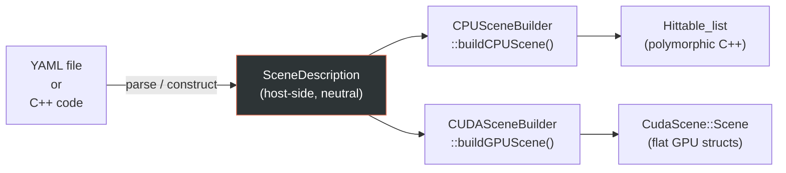

# Scene System

RayON uses a **"build once, render anywhere"** architecture. A single host-side scene description
is constructed once and can be handed to any renderer — CPU or GPU — without duplication.

---

## The core idea

GPU kernels cannot use virtual functions, heap allocation, or polymorphism. CPU code uses all
of these freely. If the CPU and GPU renderers kept separate scene representations, every change
to a scene would require updating two code paths.

Instead, RayON uses one **neutral representation** (`Scene::SceneDescription`) that is converted
into the renderer-specific format at build time:



---

## SceneDescription

Defined in `src/rayon/scene_description.hpp`, `SceneDescription` holds:

- **Materials** — a `std::vector<MaterialDesc>` with type enum + parameters union
- **Geometry** — a `std::vector<GeometryDesc>` with type enum + parameters union
- **BVH nodes** — built by `buildBVH()`, stored as a flat `std::vector<BVHNode>`
- **Camera/render settings** — resolution, samples, look_from, look_at, FOV, DOF
- **Flags** — `use_bvh`, `background_color`

### Adding objects programmatically

```cpp
// Create a scene
Scene::SceneDescription scene_desc;

// Add a material
int gold = scene_desc.addMaterial(
    MaterialDesc::roughMirror(Vec3(1.0, 0.85, 0.57), /*roughness=*/0.03)
);

// Add a sphere using that material
scene_desc.addSphere(Vec3(-2.0, 0.5, 0.0), /*radius=*/0.8, gold);

// Add a rectangle area light
int light = scene_desc.addMaterial(MaterialDesc::light(Vec3(5, 4.5, 3.5)));
scene_desc.addRectangle(Vec3(-1, 3, -2), Vec3(2.5, 0, 0), Vec3(0, 0, 1.5), light);

// Enable BVH
scene_desc.use_bvh = true;
```

This is exactly how `main.cc::create_scene_description()` builds the default scene.

---

## CPU scene building

`CPUSceneBuilder::buildCPUScene(desc)` walks the `GeometryDesc` list and instantiates normal
C++ objects:

```cpp
// CPUSceneBuilder converts descriptors to polymorphic hittables
if (geom.type == GeometryType::SPHERE) {
    list.add(std::make_shared<Sphere>(
        geom.sphere.center,
        geom.sphere.radius,
        cpu_materials[geom.material_id]
    ));
}
```

The key classes (`Sphere`, `Rectangle`, `Triangle`, etc.) inherit from `Hittable` and implement
a virtual `hit()` function. This is idiomatic C++ — no GPU concerns here.

---

## GPU scene building

`CUDASceneBuilder::buildGPUScene(desc)` converts the same description into **Plain Old Data**
structures the GPU can work with:

```cpp
// From scene_builder_cuda.cu
void convertGeometry(const GeometryDesc& g, CudaScene::Geometry& out) {
    out.type = static_cast<CudaScene::GeometryType>(g.type);
    if (g.type == GeometryType::SPHERE) {
        out.sphere.center = make_float3(g.sphere.center);
        out.sphere.radius = (float)g.sphere.radius;
    }
    // ... other types
}
```

The result is a `CudaScene::Scene` struct containing:

- `Geometry* geometries` — flat array of POD geometry structs
- `Material* materials` — flat array of POD material structs
- `BVHNode* bvh_nodes` — flat array (if BVH is enabled)
- `int num_geometries`, `int num_materials`, `int num_bvh_nodes`

All of these are allocated with `cudaMalloc` and freed after rendering.

---

## Type discrimination on the GPU

Without virtual functions, the GPU dispatcher uses switch statements:

```cpp
// From shader_common.cuh
__device__ bool intersect_geometry(const Geometry& g, const Ray& r, float t_min, float t_max,
                                   HitRecord& rec) {
    switch (g.type) {
        case GeometryType::SPHERE:
            return intersect_sphere(g.sphere, r, t_min, t_max, rec);
        case GeometryType::RECTANGLE:
            return intersect_rectangle(g.rect, r, t_min, t_max, rec);
        case GeometryType::SDF_PRIMITIVE:
            return intersect_sdf(g.sdf, r, t_min, t_max, rec);
        // ...
    }
    return false;
}
```

The same pattern is used for material evaluation:

```cpp
__device__ void scatter_material(const Material& mat, ...) {
    switch (mat.type) {
        case MaterialType::LAMBERTIAN: scatter_lambertian(...); break;
        case MaterialType::ROUGH_MIRROR: scatter_rough_mirror(...); break;
        case MaterialType::GLASS: scatter_glass(...); break;
        // ...
    }
}
```

---

## Memory layout decisions

The `BVHNode` is padded to exactly **64 bytes** — one cache line — so that a single L2 cache
line access fetches one complete node. This is critical for GPU BVH traversal performance,
where tree lookups are the primary memory bottleneck.

For `float` vs. `double`: the host builds everything in `double` precision (standard C++), and
precision is reduced to `float` at the GPU kernel boundary. This choice avoids precision
artefacts in scene geometry construction while keeping GPU compute on `float` lanes.

---

## Adding a new geometry type

1. Add the enum value to `GeometryType` in `scene_description.hpp`.
2. Add a parameters struct inside the `GeometryDesc` union.
3. Implement a CPU `Hittable` subclass in `cpu_renderers/cpu_shapes/`.
4. Add a `CudaScene::Geometry` union member in `cuda_scene.cuh`.
5. Implement `intersect_my_shape()` in `shader_common.cuh`.
6. Add the case to both switch statements above.
7. Add `convertGeometry()` case in `scene_builder_cuda.cu`.
8. Add a `SceneDescription::addMyShape()` factory method.
