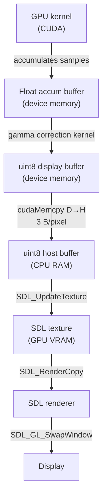

# Interactive Mode

Renderer mode 3 launches an SDL2 window where you can explore any scene in real time with
mouse-driven camera controls and an ImGui control panel.

---

## Starting interactive mode

```bash
./rayon --scene ../resources/scenes/default_scene.yaml --start-samples 32 --target-fps 60
# > Choose renderer: 3
```

Or with the default built-in scene:

```bash
./rayon --start-samples 8 --adaptive-depth
# > 3
```

!!! note "SDL2 required"
    Mode 3 is only available when SDL2 is found at CMake configure time. If the menu does not
    show option 3, rebuild with SDL2 installed.

---

## Camera controls

| Input | Effect |
|---|---|
| **Left mouse** + drag | **Orbit** — rotate the camera around the look-at point |
| **Right mouse** + drag | **Pan** — translate both camera and look-at laterally |
| **Scroll wheel** | **Zoom** — change distance from look-at point |
| **Space** | Force re-render (reset accumulation, restart at `--start-samples`) |
| **ESC** | Quit |

Any camera change immediately resets sample accumulation. The image restarts at `--start-samples`
SPP and accumulates from there.

---

## Command-line flags for interactive mode

| Flag | Default | Effect |
|---|---|---|
| `--start-samples <n>` | 32 | SPP when starting or after any camera movement |
| `--samples-per-batch <n>` | 50 | Quality ceiling: the auto-scheduler will never exceed this many samples per batch |
| `--target-fps <fps>` | 60 | Minimum frame rate target — the batch size auto-scales every frame to stay at or above this |
| `--adaptive-depth` | off | Progressively increase max bounce depth per stage |
| `--no-auto-accumulate` | off | Disable automatic sample increase when stationary |

**Example: maximum quality accumulation:**

```bash
./rayon --scene ../resources/scenes/09_color_bleed_box.yaml \
        --start-samples 8 --target-fps 30 --adaptive-depth
```

**Example: very responsive orbit for scene exploration:**

```bash
./rayon --start-samples 4 --target-fps 120 --no-auto-accumulate
```

---

## ImGui control panel

While the scene is rendering, a panel in the top-right corner of the window provides live controls:

| Control | Effect | Notes |
|---|---|---|
| **Samples** slider | Quality ceiling for the adaptive batch scheduler (`--samples-per-batch`) | Does **not** trigger a full reset; auto-scheduler immediately respects the new ceiling |
| **Max samples** slider | Upper limit for auto-accumulate | — |
| **Light intensity** | Scales area light emission | **No reset required** — updates via `cudaMemcpyToSymbol` |
| **Roughness** | Material roughness | Triggers reset |
| **Aperture** | DOF disk radius | Triggers reset |
| **Focus distance** | Thin lens focal plane | Triggers reset |
| **Max depth** | Ray bounce limit | Triggers reset |

Parameters that update without a reset (light intensity, exposure) are injected into the
running kernel via `cudaMemcpyToSymbol` — no GPU scene rebuild.

---

## Display pipeline



Only 3 bytes per pixel cross the PCIe bus each frame. At 1920×1080, that is ~6 MB per frame —
easily handled at 60 fps. Parameters that update without a full reset (light intensity, exposure)
are injected via `cudaMemcpyToSymbol` directly into the running kernel — no GPU scene rebuild needed.

---

## Sample screenshot


*Interactive mode at 2048 SPP after 20 seconds of stillness. The ImGui panel (right) shows
current samples, frame time, and live parameter sliders.*
