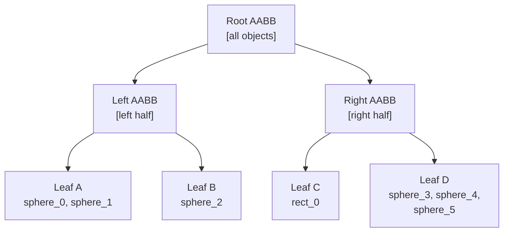
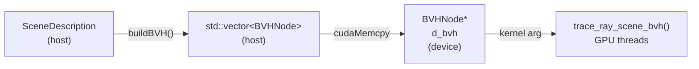

# BVH Acceleration

A **Bounding Volume Hierarchy** (BVH) is a tree of bounding boxes that lets the ray tracer skip
testing against most geometry in the scene. Without it, every ray tests against every object —
\(O(N)\) per ray, \(O(N)\) per frame. With a BVH the average cost drops to \(O(\log N)\).

---

## The problem: brute-force ray testing

For a scene with 300 objects, a 720p render at 256 SPP fires approximately:

\[
1\,280 \times 720 \times 256 = 235\,929\,600 \text{ rays}
\]

Without a BVH, each ray tests all 300 objects: **~70 billion intersection tests**.
With a BVH (depth ~9), each ray tests ~20 AABB nodes: **~5 billion tests**, with most early-outs.
That is a **14×** speedup — measured in [Performance](../performance.md).

---

## Axis-Aligned Bounding Boxes (AABB)

Every object is wrapped in an **Axis-Aligned Bounding Box** — the tightest box aligned with
the coordinate axes that fully encloses the object.

The AABB is defined by its minimum and maximum corners:

\[
\text{AABB} = [\mathbf{p}_\text{min},\, \mathbf{p}_\text{max}]
\]

**Ray-AABB intersection — the slab method:**

For each axis \(i \in \{x, y, z\}\), compute the ray parameter at entry and exit of the slab:

\[
t_{i}^{\min} = \frac{p_{\min,i} - o_i}{d_i}, \quad
t_{i}^{\max} = \frac{p_{\max,i} - o_i}{d_i}
\]

The ray hits the box if the intersection of all three intervals is non-empty:

\[
t_{\text{enter}} = \max(t_x^{\min}, t_y^{\min}, t_z^{\min}), \quad
t_{\text{exit}}  = \min(t_x^{\max}, t_y^{\max}, t_z^{\max})
\]

\[
\text{hit} \iff t_{\text{enter}} < t_{\text{exit}} \text{ and } t_{\text{exit}} > 0
\]

This is 6 comparisons — far cheaper than any geometry intersection test.

---

## Tree structure

The BVH is a binary tree. Each **internal node** stores:

- Its own AABB (bounding both children).
- Indices to left and right child nodes.

Each **leaf node** stores:

- Its own AABB.
- Indices of the 1–4 primitives it contains.



---

## Building the BVH — Surface Area Heuristic (SAH)

The BVH is built **on the CPU** before any rendering starts (either CUDA or CPU renderer).
The quality of the tree determines traversal efficiency — a bad partition can make the BVH
*slower* than brute force.

RayON uses the **Surface Area Heuristic (SAH)** to choose the optimal split:

\[
\text{Cost}(P \to L, R) = 1 + \frac{SA(L)}{SA(P)}\,N_L + \frac{SA(R)}{SA(P)}\,N_R
\]

| Symbol | Meaning |
|---|---|
| \(SA(L)\), \(SA(R)\) | Surface area of left / right child AABB |
| \(SA(P)\) | Surface area of parent AABB |
| \(N_L\), \(N_R\) | Number of primitives in each child |

The intuition: if the left child has a small surface area, a ray is less likely to enter it, so
testing many primitives there is cheap. The SAH quantifies this trade-off.

**Algorithm:**

1. Compute the centroid AABB of all objects in this partition.
2. For each axis (X, Y, Z), try \(M = 8\) split positions.
3. For each candidate split: partition objects, compute SAH cost.
4. Choose the axis + position with the lowest cost.
5. If no split is better than a leaf (cost ≥ leaf cost), make a leaf.
6. Recurse on each child.

```cpp
// From scene_description.hpp
float bestCost = std::numeric_limits<float>::max();
for (int axis = 0; axis < 3; ++axis) {
    for (int i = 0; i < NUM_SPLIT_CANDIDATES; ++i) {
        float splitPos = centroidMin[axis]
            + (centroidMax[axis] - centroidMin[axis]) * (float)(i+1) / (NUM_SPLIT_CANDIDATES+1);
        // partition & evaluate SAH cost...
        if (cost < bestCost) { bestCost = cost; bestAxis = axis; bestSplit = splitPos; }
    }
}
```

---

## GPU traversal — iterative stack

GPU kernels cannot use recursion (limited stack depth, divergence cost). The BVH tree is traversed
**iteratively** using a per-thread local stack of depth 32:

```cpp
// From shader_common.cuh — simplified
__device__ HitRecord trace_ray_scene_bvh(Ray ray, const BVHNode* bvh, ...) {
    int stack[BVH_STACK_DEPTH];
    int stackPtr = 0;
    stack[stackPtr++] = 0; // push root

    HitRecord best; best.t = INFINITY;

    while (stackPtr > 0) {
        int nodeIdx = stack[--stackPtr];
        const BVHNode& node = bvh[nodeIdx];

        if (!aabb_hit(node.aabb, ray, best.t)) continue; // miss or farther than best — skip

        if (node.is_leaf) {
            for each primitive in node → test intersection, update best
        } else {
            // Push children — push farther child first so nearer is processed first
            stack[stackPtr++] = node.right_child;
            stack[stackPtr++] = node.left_child;
        }
    }
    return best;
}
```

One important optimization: push the **farther child first** so the nearer child is at the top
of the stack and is processed next. This tends to find the closest hit sooner, allowing the
"farther than best" early-out to skip more nodes.

---

## CPU build → GPU transfer

The build happens once on the host, then the flat node array is copied to device memory:



The `BVHNode` struct is padded to 64 bytes to fit one cache line per node — critical for GPU
performance since BVH traversal is memory-bound:

```cpp
struct alignas(64) BVHNode {
    float3 aabb_min, aabb_max; // 24 bytes
    int    left_child;          //  4 bytes
    int    right_child;         //  4 bytes
    int    prim_start;          //  4 bytes
    int    prim_count;          //  4 bytes  (> 0 → leaf)
    // padding to 64 bytes
};
```

---

## Enabling BVH

In YAML:

```yaml
settings:
  use_bvh: true
```

Programmatically:

```cpp
scene_desc.use_bvh = true;
```

On the command line, BVH is always built when `use_bvh` is true in the loaded scene.
For the built-in scene, it is enabled by default.
