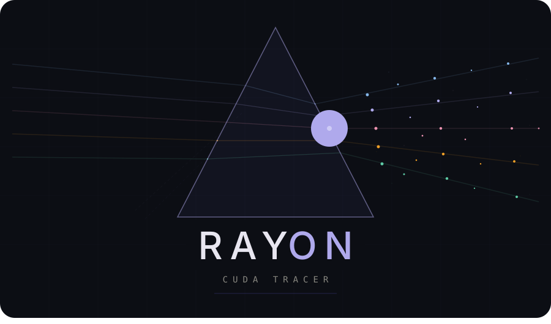

<!-- live reload probe -->

<div class="hero-banner">
  
  <p class="hero-tagline">A high-performance CUDA &amp; OptiX path tracer with real-time progressive sampling</p>
</div>

## What is RayON?

RayON is an educational and experimental **path tracer** built in C++ with CUDA and OptiX acceleration.
It started as a re-implementation of the classic
[Ray Tracing in One Weekend](https://github.com/RayTracing/raytracing.github.io) series and evolved
into a fully interactive raytracer running at **> 100 FPS @ 720p** on an NVIDIA DGX Spark.

Two GPU rendering back-ends are available at runtime — no recompilation needed:

<div class="feature-grid" markdown>
<div class="feature-card" markdown>
**CUDA GPU**

One-shot CUDA kernel with 32×4 thread blocks, warp-friendly memory layout, and persistent `curand` states.
</div>
<div class="feature-card" markdown>
**CUDA Interactive**

SDL2 window with progressive accumulation. Orbit, pan, zoom with the mouse. [`Dear ImGui`](https://github.com/ocornut/imgui) sliders for live DOF, samples, light intensity, and roughness.
</div>
</div>

!!! info "CPU renderers archived"
    The original CPU rendering backends (sequential and multi-threaded) have been moved to the
    [`legacy/cpu-renderer`](https://github.com/pmudry/RayON/tree/legacy/cpu-renderer) branch.
    The main branch now supports GPU rendering only.

It also features **BVH Acceleration**, CPU-built, with GPU-traversed Bounding Volume Hierarchy with Surface Area Heuristic (SAH) splitting. This provides 5–50× speedup on scenes with 100+ objects.

---

## Sample renders

<div class="img-grid cols-2">
  <figure>
    
    <figcaption><strong>Lambert and dielectric glass</strong> — straight from "Raytracing in one weekend".</figcaption>
  </figure>
  <figure>
    
    <figcaption><strong>Stanford dragon OBJ loading</strong> — with plastic shading and scene integration.</figcaption>
  </figure>
  <figure>
    
    <figcaption><strong>Golf Ball</strong> — procedural displacement mapping and specular highlights across the dimpled microstructure.</figcaption>
  </figure>
  <figure>
    
    <figcaption><strong>Anistropic &amp; Metals</strong> — microfacet anisotropic SDF rendering (from PBR model).</figcaption>
  </figure>
  <figure>
    
    <figcaption><strong>Thin film shading</strong> — oil, soap bubbles... you name it.</figcaption>
  </figure>
  <figure>
    
    <figcaption><strong>Cornell Box</strong> — diffuse colour bleeding and soft shadows from a rectangular area light.</figcaption>
  </figure>
</div>

---

## Quick start

```bash
# Build (requires CMake ≥ 3.20, a C++17 compiler, and optionally CUDA + SDL2)
mkdir -p build && cd build
cmake .. --fresh
make -j$(nproc)

# Run — defaults to interactive mode when SDL2 is present, offline CUDA otherwise
./rayon

# Or pick an explicit renderer with -m:
./rayon -m 2   # CUDA one-shot
./rayon -m 3   # CUDA interactive (SDL2 required)
```

Load one of the bundled example scenes:

```bash
./rayon --scene ../resources/scenes/09_color_bleed_box.yaml -s 512 -r 1080
```

See [Getting Started](getting-started.md) for the full setup guide, or
[YAML Scene Format](features/scenes.md) to author your own scenes.


---

## Explore the docs

| Section | What you'll find |
|---|---|
| [How It Works](how-it-works/index.md) | The math: ray equations, material models, BVH, sampling theory |
| [Architecture](architecture/index.md) | Code organization, CUDA renderer internals, progressive pipeline |
| [Features](features/index.md) | Interactive controls, YAML scene format, SDF shapes, OBJ loading |
| [Gallery](gallery.md) | Curated renders from all available scenes |
| [Performance](performance.md) | Benchmark results, speedup tables, tuning tips |
